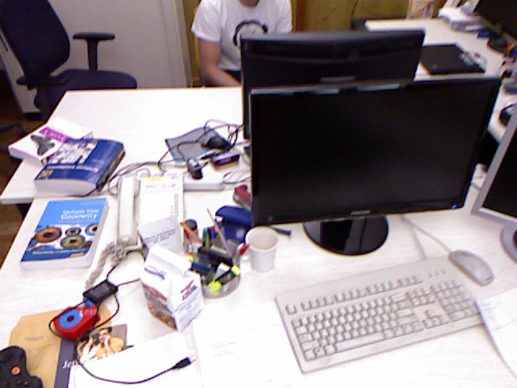
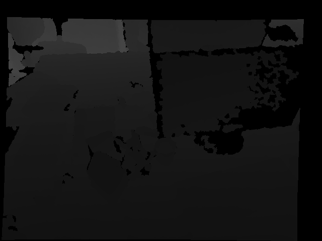
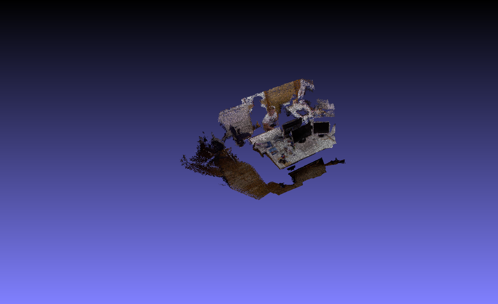

# Back-projection to 3D Space

_University Project_

The goal is to generate 3D meshes from depth and color maps which can be captured by
depth cameras, like Microsoft Kinect. 

We used the `RGB-D SLAM Dataset`

Given RGB photo: \

and the Depth photo: \

This program uses the intrinsics of the depth camera for the back-projection of the pixels to the camera space and then, using the extrinsics and the trajectory it transforms the points to the world space.
Finally, a 3D mesh of the observations is being written. 

